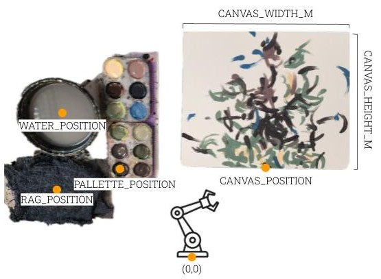

# FRIDA 

FRIDA（一个用于发展艺术的框架和机器人倡议）是一个在卡内基梅隆大学机器人研究所开发的机器人绘画项目。
fork自[原始工程](https://github.com/cmubig/Frida)，新增国产机械臂的绘画功能

# 与原始项目差异
1. 新增国产机械臂的绘画功能
2. 在Windows平台运行，因此不使用gphoto2，改为使用OpenCV读取相机

# 安装

### 系统要求

我们建议在具有Python 3.8和Ubuntu（我们使用20.04）的机器上运行FRIDA。FRIDA的核心功能使用CUDA，因此建议拥有8GB以上显存的NVIDIA GPU。由于CoFRIDA使用稳定扩散，建议在运行时拥有12GB以上显存，在训练CoFRIDA时拥有16GB显存。

### 代码安装

```
git clone https://github.com/cmubig/Frida.git

# 安装CUDA

# 我们使用Python 3.8    ps 保证numpy              1.24.1

# 使用PIP安装python包
cd Frida
pip3 install -r requirements.txt

# （或）使用Conda安装python包
cd Frida
conda env create -n frida --file environment.yml
# 注意，您可能需要根据您的CUDA版本重新安装torch/torchvision。
# 以下行在我们的CUDA 12.2系统上有效
pip uninstall torch torchvision
pip3 install torch torchvision torchaudio --index-url https://download.pytorch.org/whl/cu118

 

# （可选）要训练CoFRIDA，您需要额外的安装步骤
cd Frida/src
pip3 install git+https://github.com/facebookresearch/segment-anything.git
wget https://dl.fbaipublicfiles.com/segment_anything/sam_vit_b_01ec64.pth
git clone https://github.com/jmhessel/clipscore.git
```

### 与机器人一起运行

我们目前支持UFactory XArm和Franka Emika机器人。要使用Rethink Sawyer机器人，请安装github存储库的“ICRA 2023”标签版本。

# 物理设置 `--materials_json`

下面您可以看到FRIDA材料的描述。这些物品的位置以米为单位从机器人基座指定。它们在`--materials_json`命令行参数中指定。请参见`Frida/materials.json`以获取示例。



# 设备

以下是我们使用的设备列表以及一些购买链接。每个项目可能能够通过对代码进行小的更改来替换。

- [绘画调色板](https://www.amazon.com/gp/product/B07DKWTXWT/ref=ppx_yo_dt_b_search_asin_title?ie=UTF8&psc=1)
- [8x10英寸画布板](https://www.amazon.com/gp/product/B07RNK7DJ7/ref=ppx_yo_dt_b_search_asin_title?ie=UTF8&psc=1)
- [11x14英寸画布板](https://www.amazon.com/gp/product/B087F4F5DK/ref=ppx_yo_dt_b_search_asin_title?ie=UTF8&psc=1)
- [佳能EOS Rebel T7i（带18-55mm镜头和网络流媒体套件）](https://www.bhphotovideo.com/c/product/1714575-REG/canon_canon_eos_rebel_t7.html)
- [摄像头桌面支架](https://www.amazon.com/gp/product/B08LV7GZVB/ref=ppx_yo_dt_b_search_asin_title?ie=UTF8&th=1)

# 监控绘画进度

我们使用tensorboard来监控绘画的进度。

```
# 在另一个终端中运行此命令以查看进度
tensorboard --logdir src/painting_log
tensorboard --logdir=D:/code/frida/src/painting_log --port=6007

# 打开浏览器并导航到 http://localhost:6006/
```

# 参数

```
python3 paint.py 
    [--simulate] 仅在模拟中运行
    [--robot] 使用哪个机器人 [franka|xarm]
    [--xarm_ip] 如果使用xarm，请指定其IP地址
    [--materials_json path] 指定绘画材料位置的JSON文件
    [--use_cache] 使用缓存的校准文件。如果使用--simulation则必需
    [--cache_dir path] 如果使用缓存文件，指定存储缓存文件的目录
    [--ink] 如果使用标记或画笔，请使用此选项，以便机器人知道不需要油漆
    [--render_height int] 模拟画布的高度。减少以避免CUDA内存错误。默认256
    [--num_papers int] 要填充的完整纸张数量（每张纸30个笔画）
    [--n_colors int] 要使用的离散油漆颜色数量
    [--use_colors_from path] 如果指定，从此图像中使用K均值获取油漆颜色。默认无
    [--num_strokes int] 绘画中所需的笔画数量
    [--objective [one or many text|clip_conv_los|l2|sketch|style]]
    [--objective_data] 见下文
    [--objective_weight] 见下文
    [--num_augs int] 使用CLIP时的增强数量
    [--lr_multiplier float] 在画笔笔画参数优化算法中缩放学习率的比例
    [--num_adaptations int] 暂停机器人执行以拍照和重新规划的次数
    [--init_optim_iter int] 初始计划的优化迭代次数
    [--optim_iter int] 每次FRIDA重新规划时的优化迭代次数
```

# 目标

Frida可以使用多种不同的目标进行绘画，这些目标可以单独使用或加权组合。它们用于比较模拟绘画计划和目标数据（图像或文本）：
- `l2` - 计算绘画和目标图像之间的简单欧几里得距离
- `clip_conv_loss` - 比较从绘画和目标图像中提取的CLIP卷积特征
- `clip_fc_loss` - 比较绘画和目标图像的CLIP嵌入
- `text` - 比较绘画和输入文本描述的CLIP嵌入
- `style` - 比较绘画和目标图像的风格特征
- `sketch` - [现在请使用`clip_conv_loss`] 将绘画和目标草图转换为草图，然后进行比较
- `emotion` - 将绘画引导到以下情感：愉悦、敬畏、满足、兴奋、愤怒、厌恶、恐惧、悲伤、其他。以逗号分隔的权重列表指定。例如，半愤怒和恐惧：`--objective_data 0,0,0,0,.5,0,.5,0,0`

每个指定的目标必须有一个指定的数据文件和权重。目标可以为初始优化过程和完整的最终优化指定。以下是如何指定目标的示例，其中我们有一个初始目标使绘画看起来像`style_img.jpg`，然后一个最终目标使`style_img.jpg`的风格与文本描述“一个青蛙芭蕾舞者”相结合：
```
cd Frida/src
python3 paint.py --simulate --use_cache --cache_dir caches/sharpie_short_strokes
   --objective style text
   --objective_data path/to/style_img.jpg  "一个青蛙芭蕾舞者"
   --objective_weight 0.2  1.0
```

## 致谢

感谢：
- 王顺宇为出色的弹簧夹持的马克笔末端执行器
- [许佳晨](https://github.com/jxu12345)为编写FRIDA的感知代码
- 希拉·塞克赫和杰西·丁在设计FRIDA规划算法的早期阶段提供的帮助
- [维汉·米斯拉](https://github.com/convexalpha)为编写草图和音频损失函数
- 坦梅·香卡尔在初始安装和修复Sawyer机器人方面的帮助
- 凯文·张在Franka机器人安装方面的巨大帮助


# uarm执行绘画测试
## 仿真测试
```
cd Frida/src
& D:/ProgramData/miniconda3/envs/frida/python.exe d:/code/Frida-master/src/codraw.py --simulate --use_cache --cache_dir src/caches/sharpie_test/  --cofrida_model skeeterman/CoFRIDA-Sharpie  --dont_retrain_stroke_model --objective style text --objective_data src/caches/sharpie_test/1.png 


& D:/ProgramData/miniconda3/envs/frida/python.exe d:/code/Frida-master/src/paint.py --simulate --use_cache --cache_dir src/caches/sharpie_short_strokes --objective style text --objective_data src/caches/sharpie_test/1.png   "一个青蛙芭蕾舞者" --objective_weight 0.2  1.0
```


## 自定义机械臂需要执行如下操作
1. 修改`materials.json`文件的各个参数值，使新机械臂可以正常绘画
2. 执行`src/paint.py` 测试机械臂是否正常

## 自定义相机需要执行如下操作
1. 执行src/test_camera.py 在初始阶段需要你预先打印一张棋盘格N*N 放置到机械臂绘画区域，并保证相机可以看到它
2. 将看到：弹窗拍摄到棋盘格画面 —— 执行：按照提示进行操作，选择棋盘格相应正方形区域的四角，这将校准相机畸变、位置等参数
3. 将看到：弹窗显示拍摄到的画面 —— 确认：物理空间中画布区域都可以正常拍摄到

``` 


## 测试机械臂实际绘画

& D:/ProgramData/miniconda3/envs/frida/python.exe d:/code/Frida-master/src/paint.py
cd Frida/src
& D:/ProgramData/miniconda3/envs/frida/python.exe d:/code/Frida-master/src/paint.py --use_cache --cache_dir src/caches/sharpie_test --objective style text --objective_data  src/caches/sharpie_test/1.png  "mountain" --objective_weight 0.2  1.0

& D:/ProgramData/miniconda3/envs/frida/python.exe d:/code/Frida-master/src/paint.py --use_cache --cache_dir src/caches/sharpie_test --objective_data  src/caches/sharpie_test/1.png  "mountain" --objective_weight 0.2  1.0   --num_strokes 40 

& D:/ProgramData/miniconda3/envs/frida/python.exe d:/code/Frida-master/src/paint.py --use_cache --cache_dir src/caches/sharpie_test --objective_data  src/caches/sharpie_test/1.png  --objective_weight 0.2  1.0   --num_strokes 40

& D:/ProgramData/miniconda3/envs/frida/python.exe d:/code/frida/src/test_camera.py --robot mycobot280pi --use_cache --cache_dir src/caches/cobot280 --ink --render_height 256 --dont_retrain_stroke_model --num_strokes 100 --objective clip_conv_loss --objective_data inputs/4.jpg --objective_weight 1.0 --init_optim_iter 400 --lr_multiplier 2.0
 
```

# 测试相机
```
& D:/ProgramData/miniconda3/envs/frida/python.exe d:/code/Frida-master/src/test_camera.py  --use_cache --cache_dir D:/code/Frida-master/src/caches/sharpie_test --objective_data  src/caches/sharpie_test/1.png  "mountain" --objective_weight 0.2  1.0   --num_strokes 4
```

# 交互式绘画
使用cofrida预训练模型
```

& D:/ProgramData/miniconda3/envs/frida/python.exe d:/code/Frida-master/src/codraw.py --use_cache --cache_dir src/caches/sharpie_test/ --cofrida_model skeeterman/CoFRIDA-Sharpie --dont_retrain_stroke_model  --brush_length 0.02 --ink --lr_multiplier 0.7 --num_strokes 30 
 
```
## 交互流程示例
 
``` 
机器人已移动到安全位置。

请随意绘画，然后完成后按回车。  

如果您希望机器人绘画，请输入描述然后按回车。如果您不希望机器人绘画，请什么都不输入。
:masterpiece, (best quality), highly detailed, ultra-detailed, white background, (minimal black), a Chinese mountain top, (ink painting style:1.2), misty atmosphere, (traditional brushstroke texture), serene, (high contrast), (flowing lines), subtle shading, intricate details, vast emptiness, (classic Chinese aesthetic), balance of light and shadow.
CoFRIDA 生成选项: 100%|██████████████████████████████████████████████| 6/6 [00:07<00:00,  1.17s/it] 

```

# 仿真版本的执行命令

## 仿真版本的 Paint 执行命令
在激活的 Conda 环境中，您可以使用以下命令运行仿真版本的 `paint`：
```bash
# 激活 Conda 环境
conda activate frida

# 运行仿真版本的 paint
python src/paint.py --simulate --use_cache --cache_dir src/caches/sharpie_short_strokes --objective style text --objective_data src/caches/sharpie_test/1.png "a mountain" --objective_weight 0.2 1.0 --init_optim_iter 400 --num_strokes 800 --n_colors 2

python src/paint.py --simulate --use_cache --cache_dir src/caches/sharpie_short_strokes --lr_multiplier 0.4 --num_strokes 800 --n_colors 2 --objective clip_conv_loss --objective_data src/caches/sharpie_test/1.png --objective_weight 1.0


python src/paint.py --simulate --render_height 256 --use_cache --cache_dir src/caches/small_brush --dont_retrain_stroke_model --objective clip_conv_loss --objective_data D:/code/Frida-master/src/caches/Pittsburgh_FeaturedImg-1.jpg --objective_weight 1.0 --lr_multiplier 0.4 --num_strokes 800 --optim_iter 400 --n_colors 30
python src/paint.py --robot mycobot280pi --render_height 256 --use_cache --cache_dir src/caches/small_brush --dont_retrain_stroke_model --objective clip_conv_loss --objective_data D:/code/Frida-master/src/caches/Pittsburgh_FeaturedImg-1.jpg --objective_weight 1.0 --lr_multiplier 0.4 --num_strokes 800 --optim_iter 400 --n_colors 30


```

## 仿真版本的 CoDraw 执行命令
在激活的 Conda 环境中，您可以使用以下命令运行仿真版本的 `codraw`：
```bash
# 激活 Conda 环境
conda activate frida

# 运行仿真版本的 codraw
python src/codraw.py --use_cache --cache_dir src/caches/sharpie_test/ --cofrida_model skeeterman/CoFRIDA-Sharpie --dont_retrain_stroke_model --brush_length 0.02 --ink --lr_multiplier 0.7 --num_strokes 30  --simulate

python src/codraw.py --use_cache --cache_dir src/caches/sharpie_short_strokes/ --cofrida_model skeeterman/CoFRIDA-Sharpie --dont_retrain_stroke_model --robot xarm --brush_length 0.2 --ink --lr_multiplier 0.7 --num_strokes 120 --simulate

python src/codraw.py --simulate --use_cache --cache_dir src/caches/sharpie_short_strokes --cofrida_model skeeterman/CoFRIDA-Sharpie --lr_multiplier 0.4 --num_strokes 800 --n_colors 2 --objective clip_conv_loss --objective_data src/caches/sharpie_test/1.png --objective_weight 1.0


masterpiece, (best quality), highly detailed, ultra-detailed, white background, (minimal black), a Chinese mountain top, (ink painting style:1.2), misty atmosphere, (traditional brushstroke texture), serene, (high contrast), (flowing lines), subtle shading, intricate details, vast emptiness, (classic Chinese aesthetic), balance of light and shadow.
```

